# 小时级 PM2.5 预测实验报告初稿

## 摘要

本文围绕北京城市级小时 PM2.5 预测任务，构建了覆盖数据清洗、特征工程、多模型建模、误差分析与跨城市泛化评估的完整实验流程。针对课程项目中原先“单一远期点预测”难以真实反映短时序列预测能力的问题，本文将任务统一重构为两个主线：未来 1 小时单步预测（`h1`）与未来 6 小时逐小时预测（`seq6`）。在统一的 48 维小时级特征体系下，本文系统比较了 ARIMA、增强版 Prophet、XGBoost、LSTM 与 Transformer 五类模型的表现，并结合 AQI 分层、高污染场景、时段误差与跨城市迁移结果展开深入分析。

实验结果表明：在 `h1` 任务中，LSTM 取得最优结果，RMSE 为 11.046，MAE 为 5.239；Transformer、ARIMA 与 XGBoost 的 RMSE 也均维持在 11.1 左右，说明当前数据与特征设计已能较稳定地支持短期一步预测。在 `seq6` 任务中，XGBoost 以平均 RMSE 25.188、平均 MAE 13.953 排名第一；增强后的 Prophet 将原先明显失效的“纯时间趋势模型”改造为带 48 维回归项的直接多步模型后，平均 RMSE 降至 26.480，提升至第二名，说明外生变量与滞后项对 Prophet 的有效性至关重要。进一步分析发现，随着预测步长由 `h1` 增长到 `h6`，所有模型误差均显著累积；滚动统计与趋势特征是性能提升的关键来源；高污染场景与跨城市迁移仍然是当前方案的主要难点。

**关键词：** PM2.5 预测；小时级时间序列；多步预测；特征工程；XGBoost；LSTM；Prophet

---

## 1 引言

### 1.1 研究背景

PM2.5 是衡量空气污染水平的重要指标之一，其高浓度暴露与呼吸系统疾病、心血管疾病及公共健康风险密切相关。随着城市空气质量监测网络的完善，基于历史污染物与气象观测数据建立短期空气质量预测模型，已成为数据挖掘与环境智能中的典型问题。Wu 等[2] 对 2014–2024 年间 2327 篇 PM2.5 预测文献的系统综述表明，深度学习方法（CNN、RNN、LSTM、Transformer）已逐步取代传统统计模型成为主流范式。Cui 等[1] 在北京 12 站点小时级数据上首次将 Transformer 应用于 PM2.5 预测，取得了 R²=94.4% 的最优效果，验证了注意力机制在长序列空气质量建模中的潜力。

与日级预测相比，小时级预测更贴近实际应用场景。一方面，环境管理部门往往需要提前数小时进行污染预警；另一方面，公众出行、工业调度与应急响应也依赖更细粒度的预测结果。因此，研究小时级 PM2.5 预测，不仅具有方法论价值，也具有较强的现实意义。

### 1.2 研究问题

本文重点关注以下两个问题：

1. 在统一的数据预处理和特征工程体系下，不同模型在未来 1 小时单步预测中的性能差异如何？
2. 当任务扩展为未来 6 小时逐小时预测时，各模型误差如何随步长增长，模型排序是否发生变化？

围绕这两个问题，本文将小时级实验主线统一为：

- `single-step h1`：利用时刻 `t` 及其之前的历史观测，预测 `pm25(t+1)`。
- `seq6`：利用时刻 `t` 及其之前的历史观测，逐小时预测 `pm25(t+1)` 至 `pm25(t+6)`。

为避免记号混淆，本文后续统一采用如下命名约定：独立训练的一步预测任务记为 `single-step h1`；`seq6` 任务内部的六个预测步长分别记为 `seq6-h1` 至 `seq6-h6`；多步任务总体平均指标记为 `seq6-average`，其在结果文件中的字段名对应 `seq6_mean`。

### 1.3 研究意义

本文的意义主要体现在三个方面。

第一，任务层面上，本文从“单点远期预测”转向“单步 + 连续多步”双任务设计，使模型评价更贴近短期空气质量预测的实际需求。  
第二，方法层面上，本文构建统一的 48 维特征工程体系，为统计模型、树模型与深度模型提供可比较的输入空间。  
第三，分析层面上，本文不仅报告总体指标，还引入特征消融、AQI 分层、高污染样本、昼夜时段与跨城市迁移分析，使结论更具解释性。

### 1.4 报告结构

本文后续结构如下：第 2 章介绍数据处理、特征工程与模型方法；第 3 章说明实验设置；第 4 章展示实验结果并进行深入分析；第 5 章总结全文并讨论改进方向。

---

## 2 方法

### 2.1 数据预处理

#### 2.1.1 原始数据来源与城市级聚合

本文主实验数据为北京小时级空气质量与气象观测数据，经统一处理后形成 `data/processed/beijing_hourly.csv`。数据共 26,520 条记录，时间范围为 2013-03-01 00:00:00 至 2017-02-26 23:00:00，包含 `pm25`、`pm10`、`temp`、`pres`、`dewp`、`humidity`、`wind_speed`、`precipitation` 等核心字段。

为评估跨城市泛化能力，本文还使用对齐后的上海小时级数据进行“北京训练、上海测试”实验，相关结果记录于 `cross_city_metrics.csv`。

图 2-1 给出了本项目从原始站点数据、城市级小时样本构建、清洗预处理到训练测试划分的整体流程。与仅展示文件血缘关系的简单流程图相比，该图更直接对应了本实验的小时级建模主线。

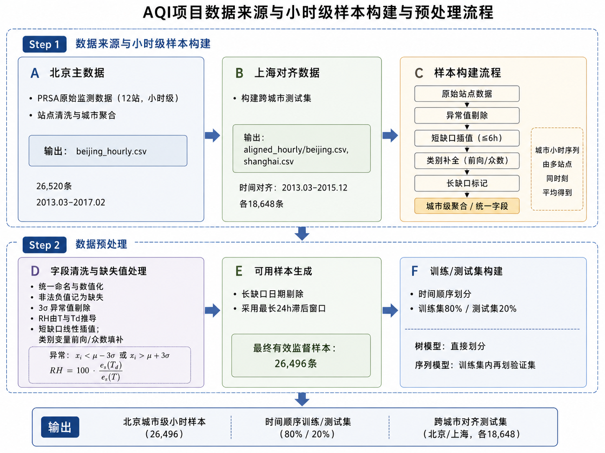

*图 2-1 AQI 项目数据来源与小时级样本构建、预处理及划分流程。*

为进一步展示主数据集的时间结构，图 2-2 给出了北京 PM2.5 日尺度聚合后的长期变化轨迹；图 2-3 展示了北京与上海对齐样本在同一时期内的变化对比，为后续跨城市泛化分析提供背景。

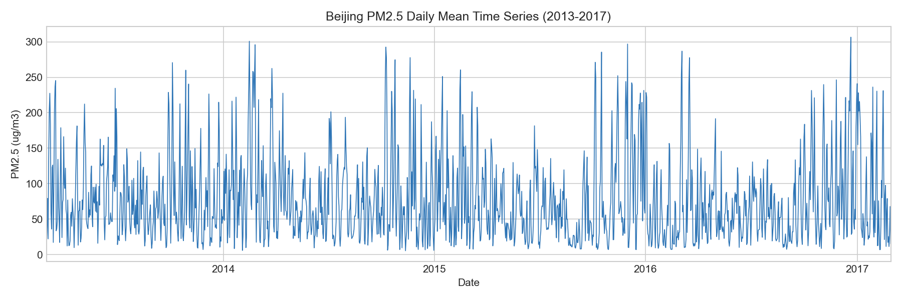

*图 2-2 北京 PM2.5 时间序列的长期变化趋势。*

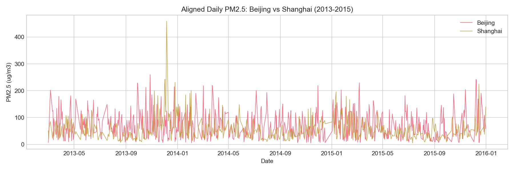

*图 2-3 北京与上海对齐样本在相同时段内的 PM2.5 波动对比。*

#### 2.1.2 缺失值与异常值处理

预处理阶段首先统一字段命名与数值类型，对非法值与明显异常值进行清洗。对短缺口采用时间顺序一致的方式插值或填补，保证后续特征构造不引入未来信息。

若记观测序列为 $\{x_t\}_{t=1}^{T}$，均值为 $\mu$、标准差为 $\sigma$，则常用的 3$\sigma$ 异常判定可以写为：

\[
x_t \text{ 为异常值} \iff x_t < \mu - 3\sigma \quad \text{或} \quad x_t > \mu + 3\sigma
\]

本文在工程实现中采用“字段清洗 + 短缺口修复 + 顺序切分”的组合策略，而非激进剔除，以尽量保留时间连续性。

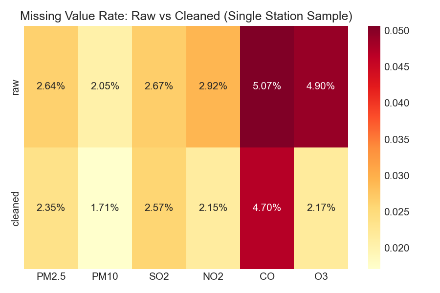

*图 2-4 典型污染物字段在原始样本与清洗后样本中的缺失比例对比。*

#### 2.1.3 建模样本构造

由于最大滞后项涉及过去 24 小时，特征构造后可用于监督学习的有效样本数为 26,496。进一步按时间顺序切分后，训练集样本数为 21,196，测试集样本数为 5,300，训练时间范围为 2013-03-02 00:00:00 至 2016-05-13 03:00:00，测试时间范围为 2016-05-13 04:00:00 至 2017-02-26 23:00:00。

### 2.2 特征工程

本文使用统一的 48 维小时级特征集，覆盖污染物历史、局部统计、时间周期、气象扰动与交互关系。

为说明特征构造的统计动机，图 2-5 给出了主要污染物与气象变量之间的相关结构。可以看到，PM2.5 与 PM10、CO 呈正相关，与部分风速、气压变量存在明显负相关关系，这为引入气象扰动特征与交互项提供了依据。

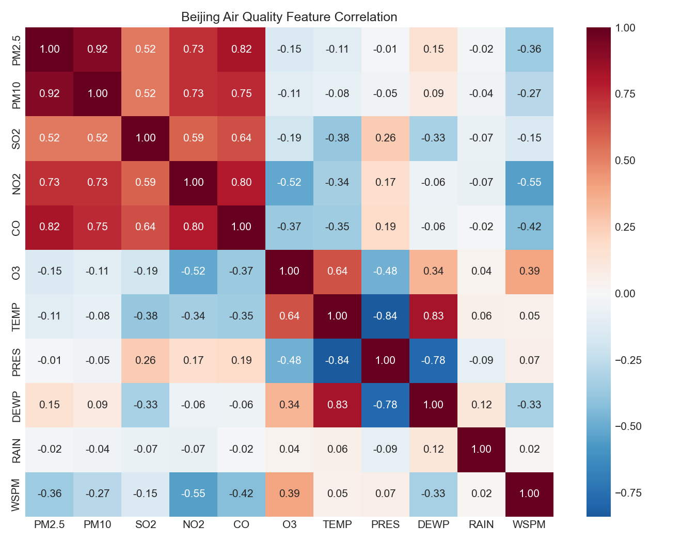

*图 2-5 北京空气质量与气象变量的相关性热力图。*

#### 2.2.1 滞后特征

为刻画污染物的短期惯性，构造如下滞后特征：

- `pm25_lag1`, `pm25_lag2`, `pm25_lag3`, `pm25_lag4`
- `pm25_lag6`, `pm25_lag8`, `pm25_lag12`, `pm25_lag24`

这类特征直接反映近 1 至 24 小时污染水平的持续性，是短时预测最核心的信息来源。

#### 2.2.2 滚动统计特征

为表示局部窗口内的稳定水平与波动性，本文构造了多种滚动均值与滚动标准差特征，例如：

- `pm25_roll_mean_3`, `pm25_roll_mean_6`, `pm25_roll_mean_12`, `pm25_roll_mean_24`
- `pm25_roll_std_3`, `pm25_roll_std_6`, `pm25_roll_std_12`, `pm25_roll_std_24`

这些特征能够补充单点滞后项无法表达的“局部趋势”和“波动强度”。

#### 2.2.3 趋势与周期特征

为增强模型对日内周期与变化方向的刻画能力，本文引入以下两类特征：

1. 差分趋势特征  
   `pm25_diff_1`, `pm25_diff_2`, `pm25_diff_3`, `pm25_diff_6`

2. 周期时间特征  
   `hour_sin`, `hour_cos`, `month_sin`, `month_cos`, `weekday`, `is_weekend`, `is_holiday`, `is_daytime`, `is_rush_hour`

周期编码采用正弦-余弦形式：

\[
hour\_sin = \sin\left(2\pi \frac{h}{24}\right), \qquad
hour\_cos = \cos\left(2\pi \frac{h}{24}\right)
\]

\[
month\_sin = \sin\left(2\pi \frac{m}{12}\right), \qquad
month\_cos = \cos\left(2\pi \frac{m}{12}\right)
\]

这种编码避免了直接使用离散时刻编号时的“边界断裂”问题。

#### 2.2.4 气象与交互特征

PM2.5 的扩散与积聚受气象条件强烈影响，因此本文保留原始气象字段：

- `temp`, `pres`, `dewp`, `humidity`, `wind_speed`, `precipitation`
- `wind_dir_sin`, `wind_dir_cos`, `precipitation_flag`, `dewp_temp_gap`

同时构造变化与交互特征，例如：

- `temp_diff_1`, `temp_diff_2`, `pres_diff_1`, `pres_diff_2`
- `wind_speed_diff_1`, `wind_speed_diff_2`
- `temp_x_humidity`, `wind_speed_x_wind_dir_sin`, `wind_speed_x_pm25_lag1`

这些特征用于增强模型对污染形成、扩散和时段气象扰动的表达能力。

### 2.3 预测模型

#### 2.3.1 ARIMA

ARIMA 是经典统计时间序列模型[4]，其基本形式为：

\[
\phi(B)(1-B)^d y_t = c + \theta(B)\varepsilon_t
\]

其中，$B$ 为滞后算子，$\phi(B)$ 为自回归部分，$\theta(B)$ 为滑动平均部分，$d$ 为差分阶数。ARIMA 的优势在于结构清晰、可解释性强，适合作为统计建模基线；不足在于对复杂非线性和多变量交互的表达能力有限。

#### 2.3.2 增强版 Prophet

传统 Prophet 适合趋势与季节性明显的时间序列[5]，其形式可写为：

\[
y(t)=g(t)+s(t)+h(t)+\varepsilon_t
\]

其中 $g(t)$ 表示趋势项，$s(t)$ 表示季节项，$h(t)$ 表示节假日或特殊事件影响项。

本项目最初的 Prophet 版本仅依赖时间戳信息，导致其在小时级 PM2.5 预测中严重退化为“平滑均值线”。因此，本文对 Prophet 做了关键增强：

- 采用**直接监督式建模**，即对每个步长单独构造目标；
- 将统一的 **48 维特征** 作为回归项加入 Prophet；
- 对 `seq6` 采用 **直接多步** 而非纯滚动时间外推；
- 保留日周期与周周期，关闭不必要的年周期；
- 使用较保守的趋势变化先验参数。

增强后，Prophet 从原先明显失效的模型恢复到可比较水平，尤其在高污染场景和 `seq6` 任务中表现显著改善。

#### 2.3.3 XGBoost

XGBoost 属于梯度提升树模型[6]，其预测函数可表示为：

\[
\hat{y}_i = \sum_{k=1}^{K} f_k(x_i), \qquad f_k \in \mathcal{F}
\]

其中 $f_k$ 为一棵回归树。XGBoost 的优势在于能够充分利用结构化特征，且对非线性关系、变量交互与缺失值具有较强适应能力。在本项目中，XGBoost 同时承担 `single-step h1` 和 `seq6` 的强基线角色，并在 `seq6-average` 上取得最优结果。

#### 2.3.4 LSTM

LSTM 是典型的循环神经网络结构[7]，通过门控机制缓解长序列训练中的梯度消失问题。其核心状态更新可简化表示为：

\[
f_t = \sigma(W_f[h_{t-1}, x_t] + b_f), \quad
i_t = \sigma(W_i[h_{t-1}, x_t] + b_i)
\]

\[
\tilde{c}_t = \tanh(W_c[h_{t-1}, x_t] + b_c), \quad
c_t = f_t \odot c_{t-1} + i_t \odot \tilde{c}_t
\]

\[
o_t = \sigma(W_o[h_{t-1}, x_t] + b_o), \quad
h_t = o_t \odot \tanh(c_t)
\]

LSTM 对局部时间依赖和短时波动具有较强建模能力，因此在 `single-step h1` 任务中表现最佳。

#### 2.3.5 Transformer

Transformer 依赖自注意力机制学习序列中远近位置之间的关系[8]。Cui 等[1] 在相同北京数据集上验证了 Transformer 在小时级 PM2.5 预测中优于 CNN-LSTM-Attention。其缩放点积注意力形式为：

\[
\text{Attention}(Q, K, V) = \text{softmax}\left(\frac{QK^\top}{\sqrt{d_k}}\right)V
\]

与循环结构相比，Transformer 更擅长捕捉跨时段的全局关联，因此在多步预测中表现稳定，整体略逊于 XGBoost，但优于 LSTM 和 ARIMA。

为更清晰地比较五类模型在本任务中的理论定位，表 2-1 总结了它们的建模假设、输入形式与适用边界。

| 模型 | 类型 | 主要假设 | 输入形式 | 适合捕捉的信息 | 局限 |
|:--|:--|:--|:--|:--|:--|
| ARIMA | 统计时间序列模型 | 序列满足线性、自相关与平稳或差分平稳假设 | 单变量历史序列 | 短期线性惯性与局部自相关 | 难以处理非线性关系与多变量交互 |
| Prophet | 趋势分解模型 | 观测序列可拆分为趋势、季节性与外生回归项 | 时间索引 + 回归项 | 周期模式、平滑趋势与节律结构 | 对突发峰值与快速结构突变不够敏感 |
| XGBoost | 集成树模型 | 非参数特征驱动，不预设显式时序形式 | 48 维结构化特征 | 非线性关系、交互项与滞后特征 | 不天然建模序列顺序，性能依赖特征工程 |
| LSTM | 循环神经网络 | 通过状态记忆建模局部时间依赖 | 历史窗口序列 | 短时动态、局部记忆与惯性延续 | 训练稳定性依赖样本量与超参数设置 |
| Transformer | 注意力时序模型 | 通过自注意力建模全局依赖与跨时段关系 | 序列窗口 | 远距离时序关联与多尺度依赖 | 在中小样本下更易过拟合，训练成本较高 |

---

## 3 实验设置

### 3.1 实验任务

本文实验包含两项主任务：

- `single-step h1`：独立训练未来 1 小时 PM2.5 单步预测模型。
- `seq6`：独立训练未来 6 小时逐小时输出的多步预测模型。

需要强调的是，`single-step h1` 与 `seq6-h1` 并不是同一个评测对象。前者来自单步任务的独立训练结果，后者来自 `seq6` 多步任务中的第 1 个输出步长，因此二者在模型结构、损失优化和误差水平上都不应直接等同。

其中，`seq6-average` 作为多步任务总体指标，用于汇总各模型在 `seq6-h1` 至 `seq6-h6` 六个步长上的整体性能；在结果文件中，该字段对应 `seq6_mean`。

### 3.2 数据集划分

实验采用严格的时间顺序划分：

- 训练集：前 80%
- 测试集：后 20%

该设置避免了时间穿越问题，保证评价更接近真实预测场景。

### 3.3 评价指标

本文使用 RMSE、MAE 和 MAPE 作为核心评价指标：

\[
\text{RMSE} = \sqrt{\frac{1}{n}\sum_{i=1}^{n}(y_i-\hat{y}_i)^2}
\]

\[
\text{MAE} = \frac{1}{n}\sum_{i=1}^{n}|y_i-\hat{y}_i|
\]

\[
\text{MAPE} = \frac{100\%}{n}\sum_{i=1}^{n}\left|\frac{y_i-\hat{y}_i}{y_i}\right|
\]

其中 RMSE 对大误差更敏感，MAE 更直观反映平均偏差，MAPE 用于刻画相对误差水平。此外，Diebold-Mariano 检验[10] 可用于判断不同模型预测精度差异是否具有统计显著性。

### 3.4 实验环境与输出文件

所有结果统一保存在 `outputs/hourly/` 目录下。本文写作使用的主要结果文件包括：

- `overall_metrics_summary.csv`
- `feature_ablation.csv`
- `aqi_bucket_metrics.csv`
- `high_pollution_error_analysis.csv`
- `hourly_error_by_dayperiod.csv`
- `cross_city_metrics.csv`

插图统一使用 `outputs/hourly/figures/` 中以 `fig` 开头的最新图片。

---

## 4 实验结果与分析

### 4.1 模型整体结果比较

表 4-1 给出了 `single-step h1` 与 `seq6-average` 两项主任务上的整体比较结果。

| 任务 | 排名 | 模型 | RMSE | MAE | MAPE |
|:--|:--|:--|--:|--:|--:|
| single-step h1 | 1 | LSTM | 11.046 | 5.239 | 12.595 |
| single-step h1 | 2 | Transformer | 11.167 | 5.492 | 12.864 |
| single-step h1 | 3 | ARIMA | 11.271 | 5.141 | 13.099 |
| single-step h1 | 4 | XGBoost | 11.293 | 5.145 | 11.418 |
| single-step h1 | 5 | Prophet | 11.800 | 6.770 | 24.176 |
| seq6-average | 1 | XGBoost | 25.188 | 13.953 | 37.082 |
| seq6-average | 2 | Prophet | 26.480 | 16.523 | 58.541 |
| seq6-average | 3 | Transformer | 26.669 | 16.006 | 43.123 |
| seq6-average | 4 | LSTM | 30.814 | 18.774 | 42.943 |
| seq6-average | 5 | ARIMA | 31.154 | 18.768 | 58.497 |

从整体结果看，短期一步预测与多步预测呈现出不同的模型优势分布。LSTM 在 `single-step h1` 上最优，说明递归记忆结构对局部短期动态具有较强刻画能力；而 `seq6-average` 上 XGBoost 最优，说明在多步任务中，显式特征工程与直接多步建模的组合更加稳定。

值得注意的是，增强版 Prophet 不再处于明显失效状态。经过“直接监督 + 48 维回归项”改造后，其 `single-step h1` RMSE 降至 11.800，`seq6-average` RMSE 降至 26.480，已经进入可比较范围，并在多步平均指标上排名第二。这一结果也从反面说明：对于小时级 PM2.5 任务，Prophet 是否有效高度依赖回归项设计，而不是仅靠时间趋势分解。

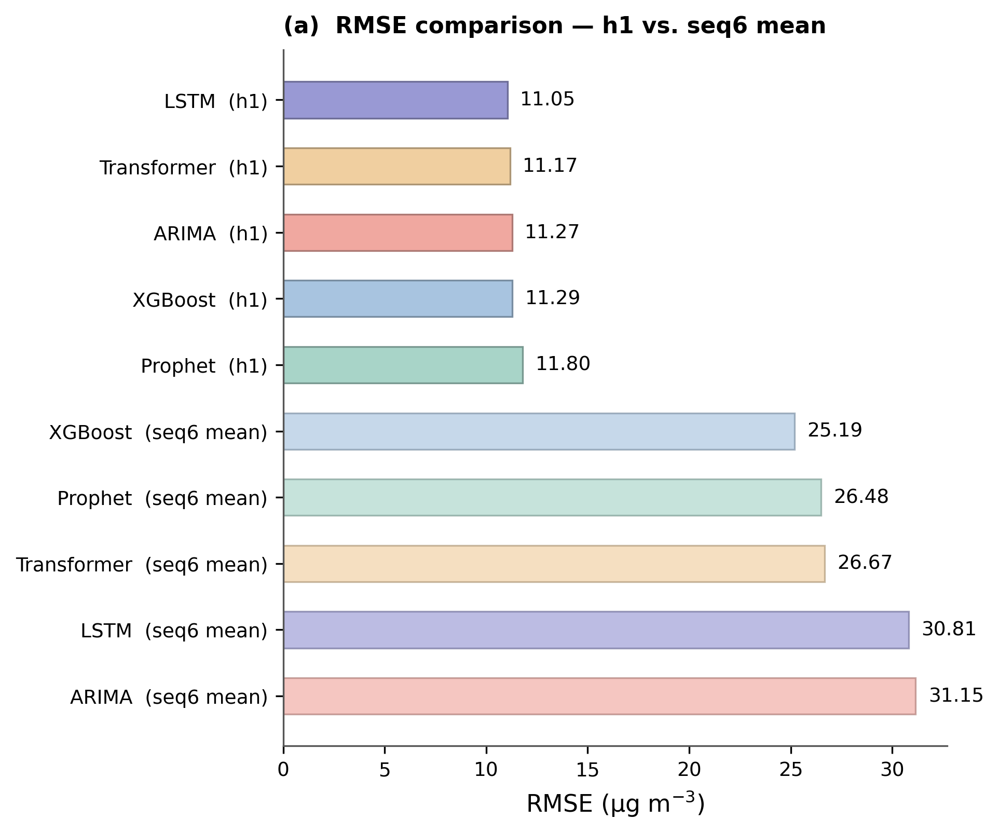

*图 4-1 各模型在 `single-step h1` 与 `seq6-average` 任务上的 RMSE 比较。*

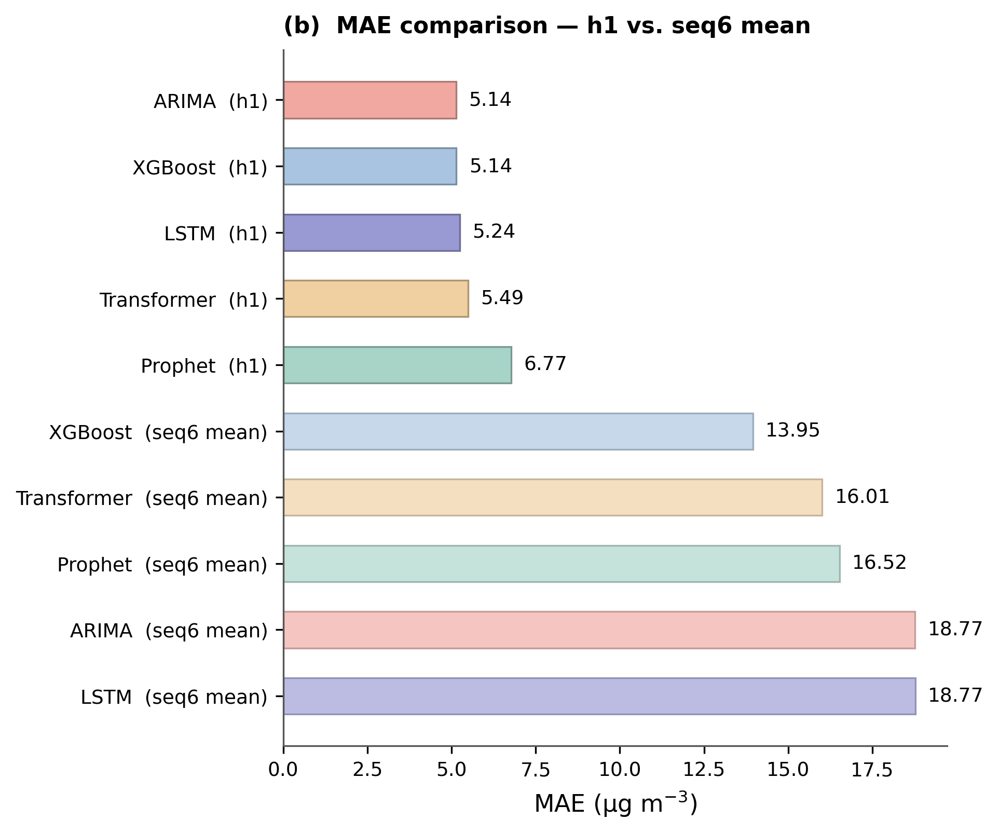

*图 4-2 各模型在 `single-step h1` 与 `seq6-average` 任务上的 MAE 比较。*

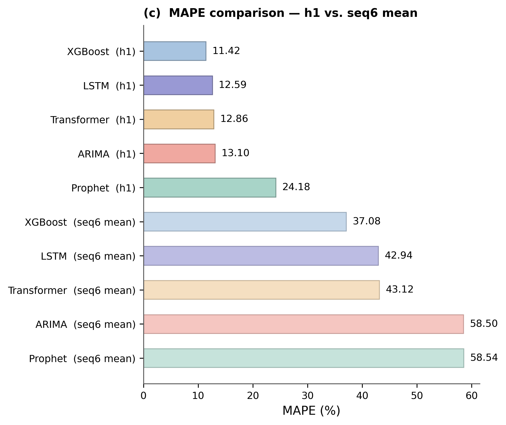

*图 4-3 各模型在 `single-step h1` 与 `seq6-average` 任务上的 MAPE 比较。*

### 4.2 `single-step h1` 单步预测结果分析

`single-step h1` 任务的主要特征是步长极短、对当前污染惯性依赖强、对局部波动跟踪能力要求高。图 4-4 至图 4-6 展示了该任务下的曲线、模型排名与观测值-预测值散点分布。

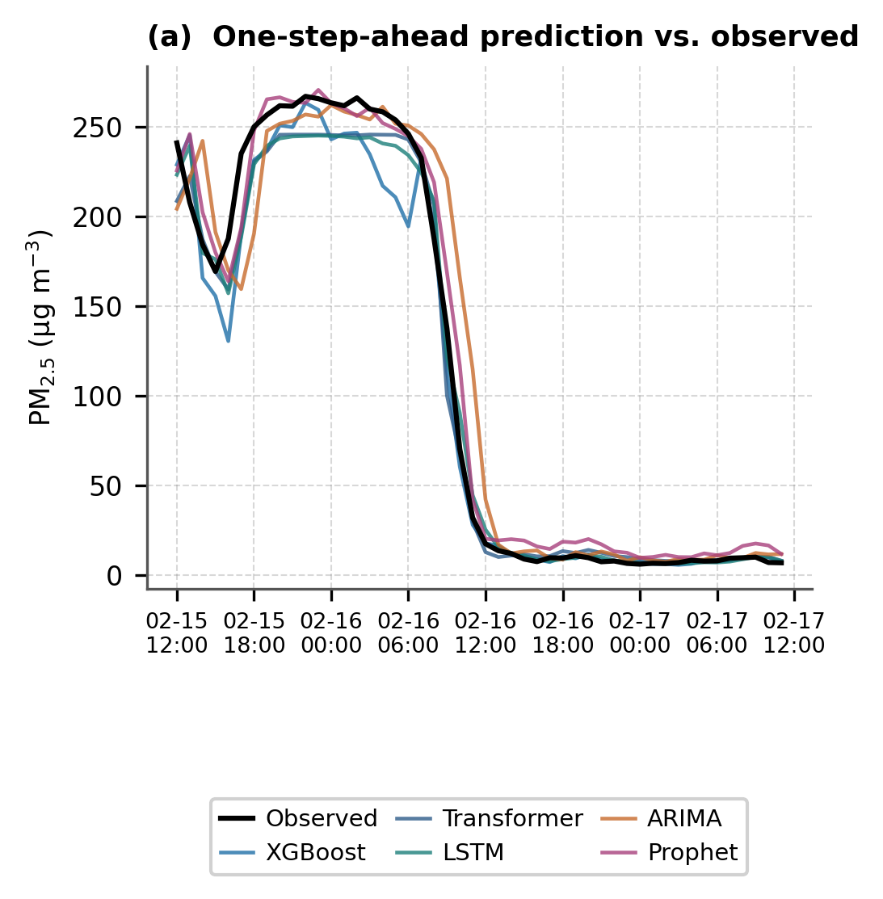

*图 4-4 `single-step h1` 任务的真实值与预测曲线。*

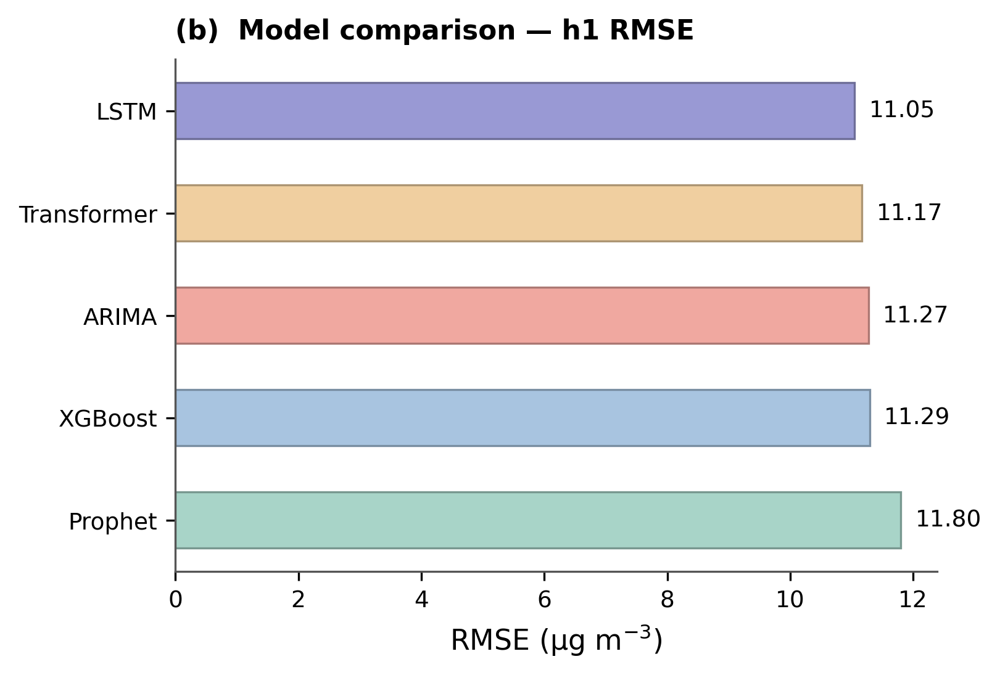

*图 4-5 `single-step h1` 任务下各模型 RMSE 排序。*

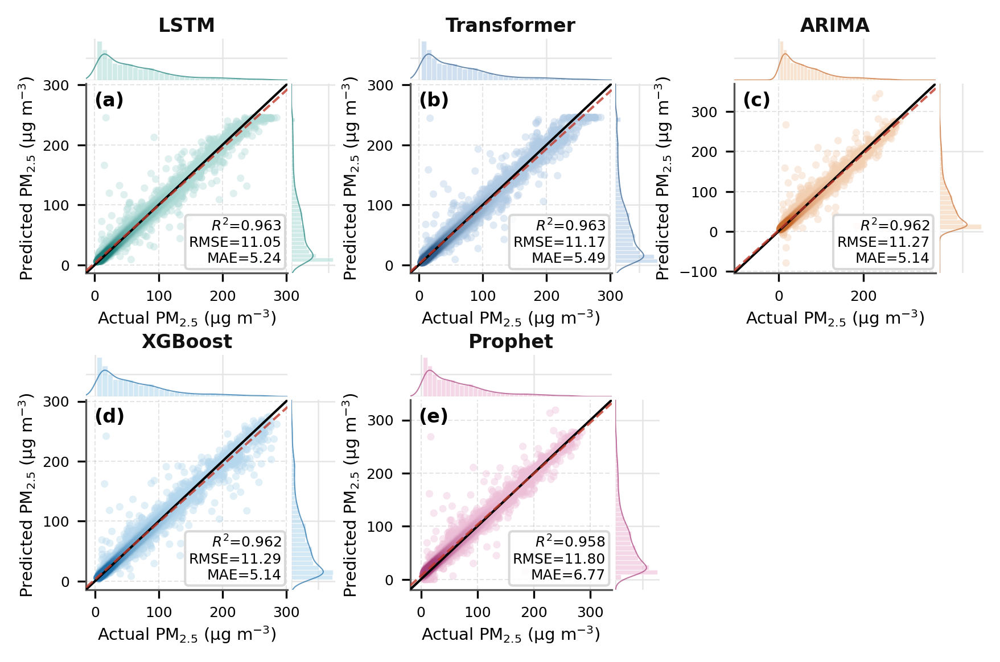

*图 4-6 `single-step h1` 任务下各模型观测值与预测值的散点对比。*

可以看到，`single-step h1` 任务下前四个模型的 RMSE 极为接近，说明当前数据和特征体系下，多个模型都已接近这一任务的有效上限。LSTM 略优于 Transformer 和 ARIMA，体现了其对局部时序依赖的优势；XGBoost 虽然 RMSE 稍高，但其 MAPE 最低，说明它在相对误差控制方面更稳定。

增强版 Prophet 在 `single-step h1` 上虽未进入前三，但已从原先无法使用的水平回到可接受范围。其绝对误差仍高于其他强模型，说明 Prophet 即使加入外生变量后，在一步预测上仍不如专门的时序深度模型和树模型敏捷。

### 4.3 `seq6` 多步预测结果分析

图 4-7 至图 4-9 展示了 `seq6` 任务下的典型预测曲线、误差随步长变化趋势和平均 RMSE 对比。

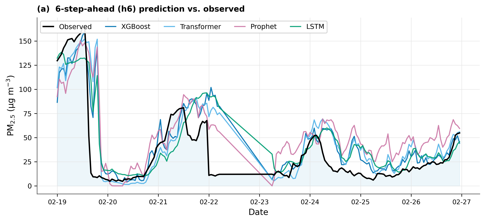

*图 4-7 `seq6` 中第 6 小时预测曲线对比。*

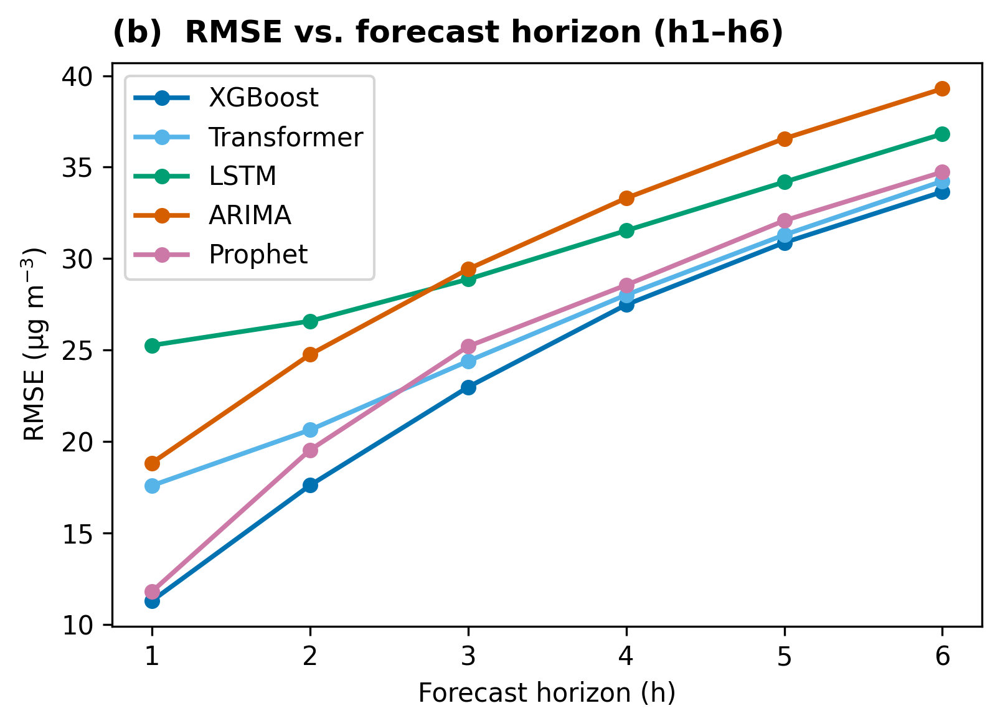

*图 4-8 各模型在 `seq6-h1` 至 `seq6-h6` 上的 RMSE 变化。*

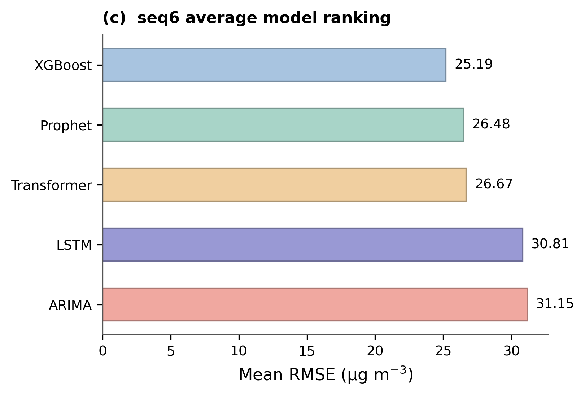

*图 4-9 各模型在 `seq6-average` 指标上的平均 RMSE 对比。*

表 4-2 给出了每个步长上的 Prophet、XGBoost 与 Transformer 结果。

| 步长 | XGBoost RMSE | Prophet RMSE | Transformer RMSE |
|:--|--:|--:|--:|
| seq6-h1 | 11.293 | 11.800 | 17.593 |
| seq6-h2 | 17.610 | 19.538 | 20.637 |
| seq6-h3 | 22.980 | 25.203 | 24.400 |
| seq6-h4 | 27.480 | 28.557 | 28.018 |
| seq6-h5 | 30.875 | 32.078 | 31.298 |
| seq6-h6 | 33.653 | 34.737 | 34.237 |

从表中可以看到，XGBoost 在六个步长上整体最稳定，并取得最低平均 RMSE。增强版 Prophet 的多步误差显著改善，尤其在 `seq6-h1` 和 `seq6-h2` 上已具有较强竞争力；但随着步长增加，其误差累积速度仍略快于 XGBoost。Transformer 在中后段步长上保持稳定，是 `seq6` 的第三强模型。

总体而言，多步预测的一个稳定结论是：**步长越远，误差越大**。这说明在缺乏未来气象预报与未来外生变量的前提下，仅依赖历史观测进行连续外推，难以避免信息衰减带来的误差积累。

### 4.4 特征工程有效性分析

#### 4.4.1 特征消融实验

为验证各类特征的实际贡献，本文在 XGBoost 上进行分组消融实验。结果如表 4-3 所示。

| 任务 | 特征组 | 特征数 | RMSE | MAE |
|:--|:--|--:|--:|--:|
| single-step h1 | trend_and_roll | 25 | 11.010 | 5.095 |
| single-step h1 | weather_enhanced | 35 | 11.021 | 5.061 |
| single-step h1 | full_48 | 48 | 11.291 | 5.122 |
| single-step h1 | base_short_lag | 9 | 17.295 | 9.306 |
| seq6-average | weather_enhanced | 35 | 24.005 | 13.941 |
| seq6-average | full_48 | 48 | 24.085 | 13.952 |
| seq6-average | trend_and_roll | 25 | 24.145 | 14.344 |
| seq6-average | base_short_lag | 9 | 29.284 | 18.160 |

结果表明：

- 对 `single-step h1` 而言，滚动统计与趋势特征最关键，单纯短滞后远远不够；
- 对 `seq6` 而言，加入气象增强特征后提升更明显；
- 全部 48 维特征并不总是严格优于精简特征组，说明更多特征并不必然带来更好性能。

需要说明的是，表 4-3 中的 `seq6-average` 采用六个步长 RMSE 与 MAE 的算术平均，用于比较不同特征组在各步长上的整体表现；而表 4-1 中的 `seq6-average` 对应结果文件 `seq6_mean`，其数值来自全部多步预测残差的 pooled 统计。因此，两张表中的数值口径不同，不应作一一相等的机械比较。

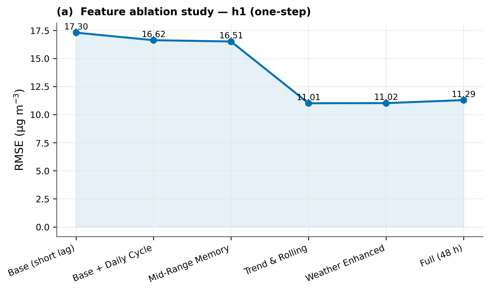

*图 4-10 `single-step h1` 任务下不同特征组的消融结果。*

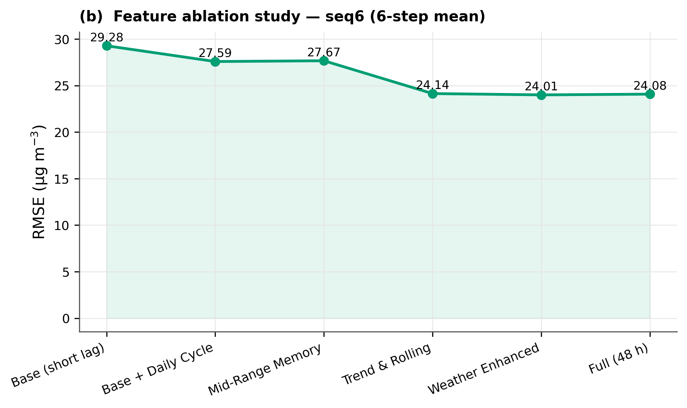

*图 4-11 `seq6` 任务下不同特征组的消融结果。*

#### 4.4.2 特征重要性分析

XGBoost 的特征重要性结果进一步验证了上述结论。`single-step h1` 任务中，排名靠前的特征主要集中于 `pm25_lag1`、滚动均值、短差分与近时刻气象变量；`seq6` 任务中，风速变化、湿度、时段周期和交互项的重要性进一步上升。本文使用 SHAP[9] 方法对模型预测进行全局解释，结果如图 4-12 与图 4-13 所示。这说明：

1. 小时级 PM2.5 预测本质上是强短期惯性问题；
2. 多步预测对“趋势 + 气象扰动”的依赖比单步更明显；
3. 特征工程仍是当前实验体系中的关键性能来源。

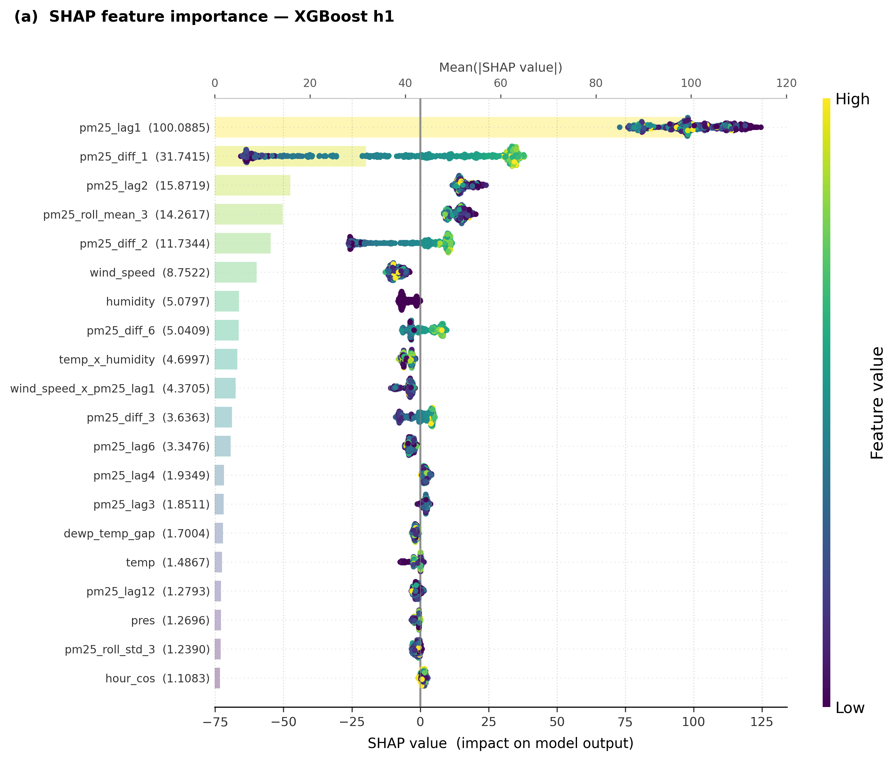

*图 4-12 `single-step h1` 任务下 XGBoost 的 SHAP 全局解释结果。*

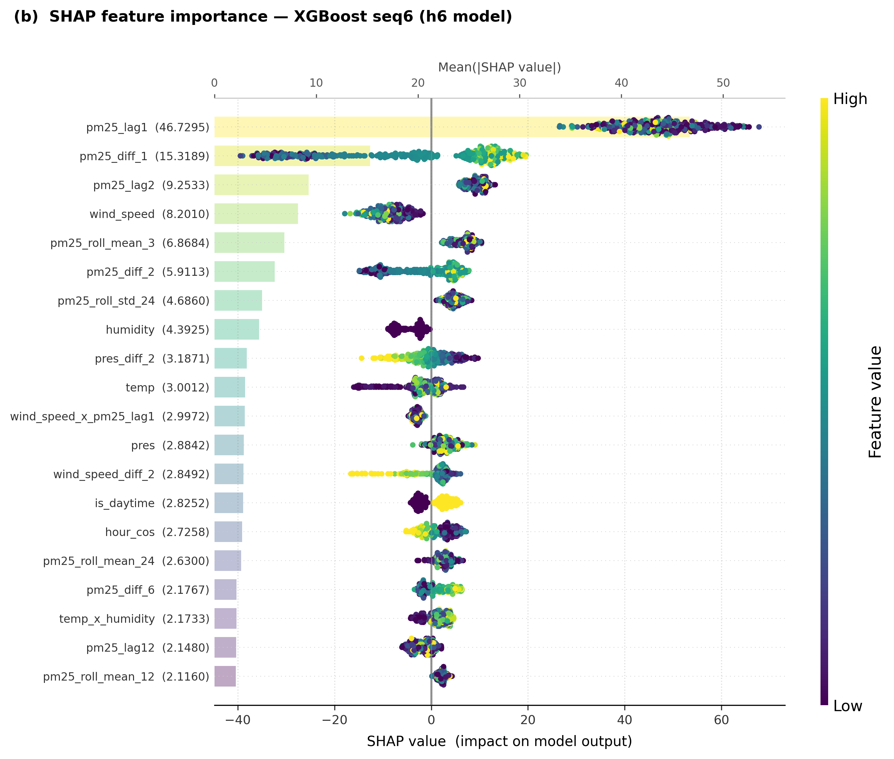

*图 4-13 `seq6` 任务下 XGBoost 的 SHAP 全局解释结果。*

### 4.5 分层与场景误差分析

#### 4.5.1 AQI 分层误差

AQI 分层结果说明，不同模型在不同污染区间中的最优性并不完全一致。

在 `single-step h1` 任务中：

- `0-35`、`35-75`、`75-115` 区间内，XGBoost 最优；
- `115-150` 与 `>150` 区间内，增强版 Prophet 的 RMSE 最低。

在 `seq6-h6` 任务中：

- `35-75`、`75-115`、`115-150` 区间内，XGBoost 表现最稳；
- `0-35` 区间内，LSTM 最优；
- `>150` 区间内，增强版 Prophet 误差最低。

这说明 Prophet 在加入回归项后，对高污染强度区间的拟合能力显著改善，已经不再是旧版报告中“高污染场景完全失效”的模型。

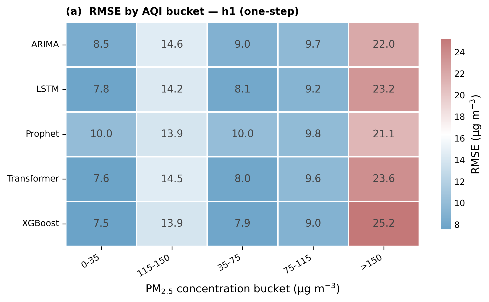

*图 4-14 `single-step h1` 任务下 AQI 分层误差热力图。*

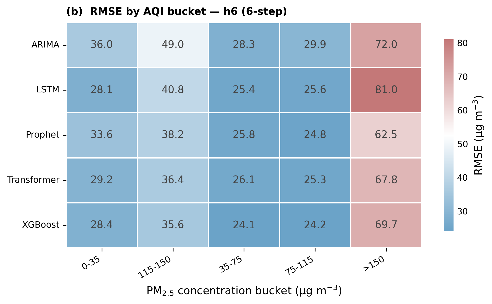

*图 4-15 `seq6` 任务下 AQI 分层误差热力图。*

#### 4.5.2 高污染场景分析

在高污染样本（`y_true > 150`）上，模型表现与总体排序明显不同。

表 4-4 给出关键结果：

| 任务 | 排名 | 模型 | RMSE | MAE |
|:--|:--|:--|--:|--:|
| single-step h1 | 1 | Prophet | 21.094 | 9.780 |
| single-step h1 | 2 | ARIMA | 22.004 | 10.685 |
| single-step h1 | 3 | LSTM | 23.190 | 12.006 |
| single-step h1 | 4 | Transformer | 23.619 | 13.232 |
| single-step h1 | 5 | XGBoost | 25.177 | 13.314 |
| seq6-h6 | 1 | Prophet | 62.489 | 50.646 |
| seq6-h6 | 2 | Transformer | 67.834 | 55.773 |
| seq6-h6 | 3 | XGBoost | 69.702 | 56.592 |

本文已统一依据 `high_pollution_error_analysis.csv` 重新生成表 4-4 以及图 4-16、图 4-17，三者统计口径完全一致。由此可见，增强版 Prophet 虽然在总体平均指标上未必第一，但在高污染极端样本中最稳。这意味着其平滑趋势结构在极端污染阶段并非无效；相反，当引入充足回归项后，它对高值段的拟合反而具备优势。

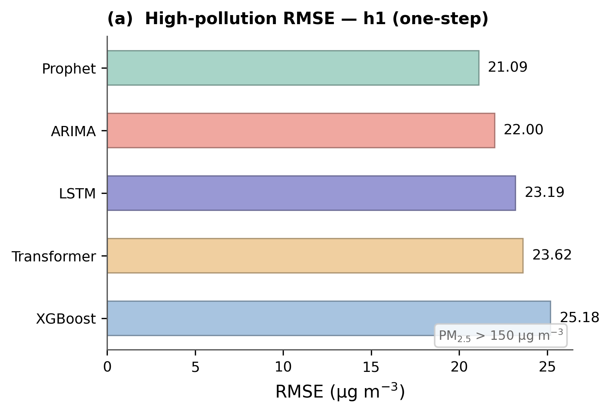

*图 4-16 `single-step h1` 任务高污染场景误差比较。*

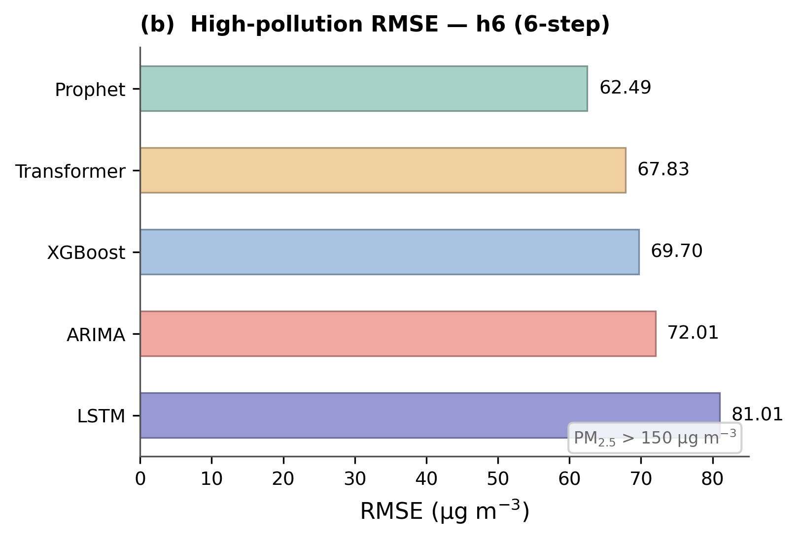

*图 4-17 `seq6-h6` 高污染场景误差比较。*

#### 4.5.3 昼夜与时段误差分析

按典型时段划分后，模型最优性进一步表现出明显差异。

在 `single-step h1` 中：

- `daytime`、`evening_peak`、`night`：XGBoost 最优；
- `morning_peak`：LSTM 最优；
- `overnight`：ARIMA 最优。

在 `seq6-h6` 中：

- `daytime`：Transformer 最优；
- 其余 `evening_peak`、`morning_peak`、`night`、`overnight`：XGBoost 最优。

这表明不同模型对不同时段的污染动力学具有不同适应性。循环与注意力模型更容易捕捉某些规律性时段，而树模型在大多数复杂时段上保持稳定。

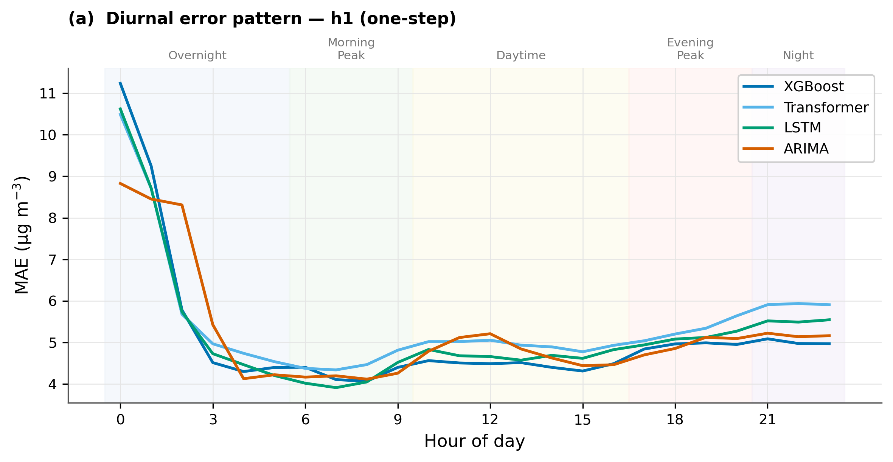

*图 4-18 `single-step h1` 任务分小时误差变化。*

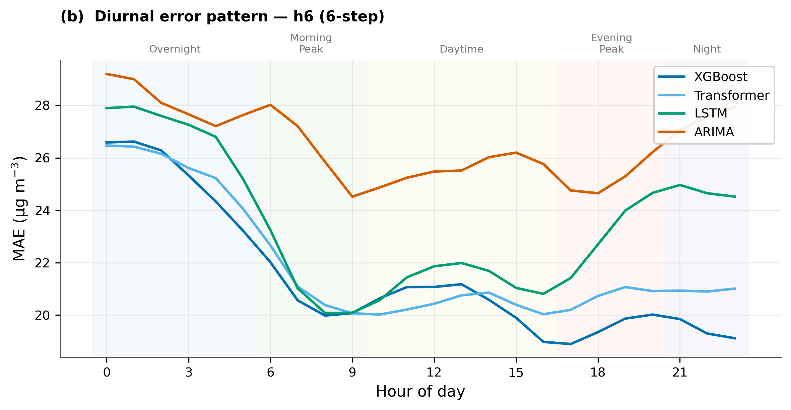

*图 4-19 `seq6` 任务分小时误差变化。*

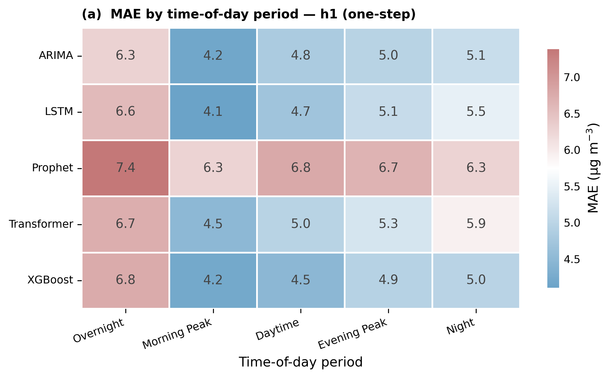

*图 4-20 `single-step h1` 任务典型时段误差热力图。*

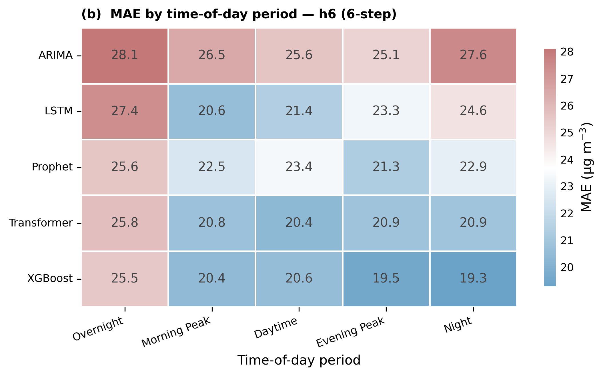

*图 4-21 `seq6` 任务典型时段误差热力图。*

### 4.6 跨城市泛化分析

为评估模型迁移能力，本文使用 XGBoost 开展“北京训练、上海测试”的跨城市实验。Poelzl 等[3] 在 Graz→Zagreb 的跨城市 PM10 迁移实验中证明，仅需 20% 目标城市标注数据即可实现 22% 的性能提升，验证了迁移学习在空气质量预测中的可行性。本文结果如表 4-5 所示。

| 步长 | 本地测试 RMSE | 跨城市 RMSE | 泛化误差增量 |
|:--|--:|--:|--:|
| seq6-h1 | 11.293 | 17.866 | 6.573 |
| seq6-h2 | 17.610 | 25.685 | 8.076 |
| seq6-h3 | 22.980 | 29.884 | 6.904 |
| seq6-h4 | 27.480 | 33.317 | 5.837 |
| seq6-h5 | 30.875 | 34.193 | 3.318 |
| seq6-h6 | 33.653 | 34.953 | 1.300 |

可以看到，跨城市预测误差整体高于本地测试，其中 `seq6-h2` 的性能损失最大，RMSE 增量达到 8.076。这说明模型学习到的部分污染模式仍明显依赖训练城市的气象分布、污染源结构与时间活动模式。

不过，随着步长增大到 `seq6-h6`，跨城市与本地的 RMSE 差距逐渐缩小。这并不意味着跨城市更容易，而是因为远期预测本身已经足够困难，城市分布差异带来的边际影响被“多步误差累积”部分淹没。

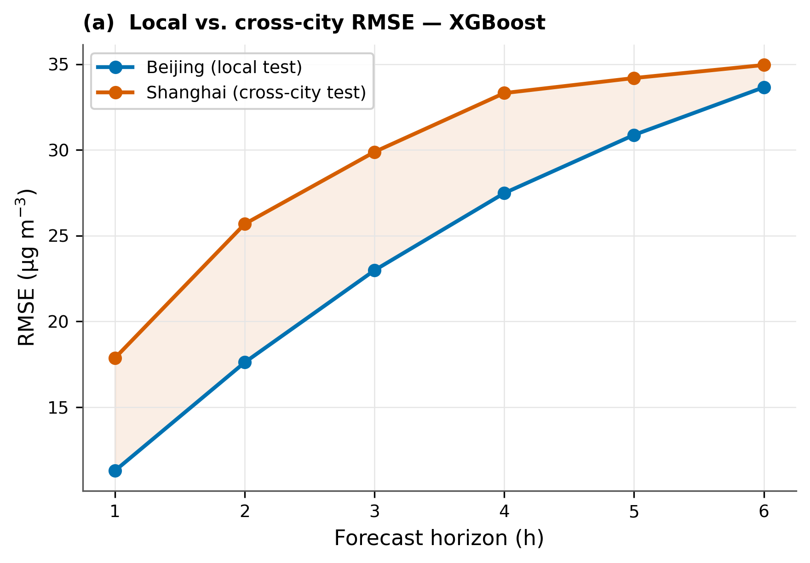

*图 4-22 本地测试与跨城市测试下的 RMSE 曲线。*

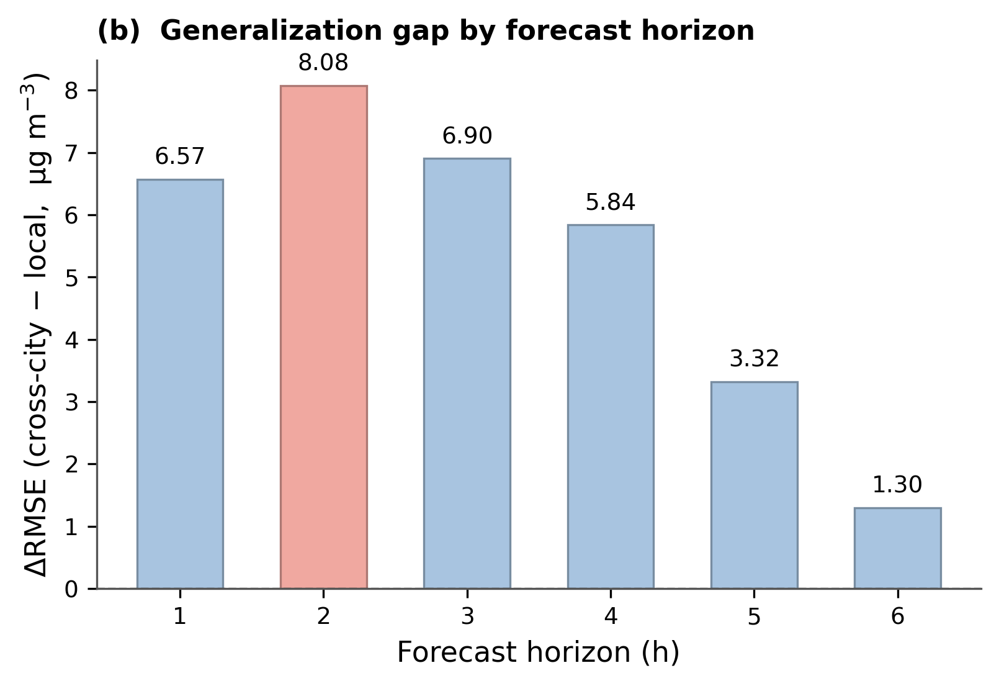

*图 4-23 不同步长上的跨城市泛化误差增量。*

---

## 5 结论与展望

### 5.1 主要结论

本文围绕小时级 PM2.5 预测任务完成了从数据处理到结果分析的完整实验流程，并得到以下主要结论：

1. 在 `single-step h1` 单步预测中，LSTM 表现最佳，说明循环神经网络在极短期预测中对局部时间依赖的建模能力最强。
2. 在 `seq6` 多步预测中，XGBoost 取得最低 `seq6-average` RMSE，表明显式特征工程与直接多步策略在当前数据规模下更稳定。
3. 增强版 Prophet 相比旧版结果有显著改进，已经从失效模型提升为 `seq6-average` 第二名，并在高污染样本上表现突出。
4. 滚动统计、趋势特征与气象增强项是提升性能的核心来源，特征工程仍是当前实验体系的关键。
5. 高污染场景与跨城市迁移仍是主要难点，尤其说明“总体均值最优”不等于“极端场景最优”。

### 5.2 研究不足

尽管当前结果较完整，但仍存在以下不足：

- 多步预测仍未引入未来气象预报信息；
- 跨城市实验目前只在 XGBoost 上系统展开；
- 深度模型的结构与超参数搜索仍可继续加强；
- 报告中的解释主要基于误差统计，尚未引入更细粒度的可解释性工具。

### 5.3 后续工作

后续可从以下方向继续改进：

1. 引入未来气象预报或再分析产品，提高多步预测上限；
2. 尝试更适合多步输出的时序结构，如 Wu 等[2] 建议的 TFT、Informer 或 N-BEATS；
3. 对高污染样本引入重加权训练或分段建模；
4. 参照 Poelzl 等[3] 的迁移学习策略，将增强版 Prophet 的建模思想扩展到跨城市迁移实验中；
5. 结合 SHAP、注意力可视化等方法增强结果解释性。

---

## 参考文献

[1] Cui, B., Liu, M., Li, S., Jin, Z., Zeng, Y., & Lin, X. (2023). Deep learning methods for atmospheric PM2.5 prediction: A comparative study of transformer and CNN-LSTM-attention. *Atmospheric Pollution Research*, 14(9), 101833. https://doi.org/10.1016/j.apr.2023.101833

[2] Wu, C., Wang, R., Lu, S., Tian, J., Yin, L., Wang, L., & Zheng, W. (2025). Time-series data-driven PM2.5 forecasting: From theoretical framework to empirical analysis. *Atmosphere*, 16(3), 292. https://doi.org/10.3390/atmos16030292

[3] Poelzl, M., Kern, R., Kecorius, S., & Lovrić, M. (2025). Exploration of transfer learning techniques for the prediction of PM10. *Scientific Reports*, 15, 2919. https://doi.org/10.1038/s41598-025-86550-6

[4] Box, G. E. P., Jenkins, G. M., Reinsel, G. C., & Ljung, G. M. (2015). *Time Series Analysis: Forecasting and Control* (5th ed.). Wiley.

[5] Taylor, S. J., & Letham, B. (2018). Forecasting at scale. *The American Statistician*, 72(1), 37–45. https://doi.org/10.1080/00031305.2017.1380080

[6] Chen, T., & Guestrin, C. (2016). XGBoost: A scalable tree boosting system. *Proceedings of the 22nd ACM SIGKDD International Conference on Knowledge Discovery and Data Mining* (pp. 785–794). https://doi.org/10.1145/2939672.2939785

[7] Hochreiter, S., & Schmidhuber, J. (1997). Long short-term memory. *Neural Computation*, 9(8), 1735–1780. https://doi.org/10.1162/neco.1997.9.8.1735

[8] Vaswani, A., Shazeer, N., Parmar, N., Uszkoreit, J., Jones, L., Gomez, A. N., Kaiser, Ł., & Polosukhin, I. (2017). Attention is all you need. *Advances in Neural Information Processing Systems*, 30, 5998–6008.

[9] Lundberg, S. M., & Lee, S.-I. (2017). A unified approach to interpreting model predictions. *Advances in Neural Information Processing Systems*, 30, 4765–4774.

[10] Diebold, F. X., & Mariano, R. S. (1995). Comparing predictive accuracy. *Journal of Business & Economic Statistics*, 13(3), 253–263. https://doi.org/10.1080/07350015.1995.10524599

---

## 附录

### 附录 A 主要图表文件

本文正文使用的主要图片如下：

- `figures/00_hourly_pipeline_overview.png`
- `figures/01_pm25_timeseries.png`
- `figures/04_correlation_heatmap.png`
- `figures/05_missing_heatmap.png`
- `figures/06_city_comparison.png`
- `../outputs/hourly/figures/fig01_h1_prediction_curve.png`
- `../outputs/hourly/figures/fig02_h1_model_rmse.png`
- `../outputs/hourly/figures/fig03_h1_scatter_grid.png`
- `../outputs/hourly/figures/fig04_h6_prediction_curve.png`
- `../outputs/hourly/figures/fig05_rmse_vs_horizon.png`
- `../outputs/hourly/figures/fig06_seq6_avg_rmse.png`
- `../outputs/hourly/figures/fig07_overall_rmse.png`
- `../outputs/hourly/figures/fig08_overall_mae.png`
- `../outputs/hourly/figures/fig09_overall_mape.png`
- `../outputs/hourly/figures/fig10_shap_h1.png`
- `../outputs/hourly/figures/fig11_shap_seq6.png`
- `../outputs/hourly/figures/fig12_aqi_heatmap_h1.png`
- `../outputs/hourly/figures/fig13_aqi_heatmap_seq6.png`
- `../outputs/hourly/figures/fig14_feature_ablation_h1.png`
- `../outputs/hourly/figures/fig15_feature_ablation_seq6.png`
- `../outputs/hourly/figures/fig16_high_pollution_h1.png`
- `../outputs/hourly/figures/fig17_high_pollution_seq6.png`
- `../outputs/hourly/figures/fig18_error_by_hour_h1.png`
- `../outputs/hourly/figures/fig19_error_by_hour_seq6.png`
- `../outputs/hourly/figures/fig20_dayperiod_heatmap_h1.png`
- `../outputs/hourly/figures/fig21_dayperiod_heatmap_seq6.png`
- `../outputs/hourly/figures/fig22_cross_city_rmse.png`
- `../outputs/hourly/figures/fig23_generalization_gap.png`

### 附录 B 主要结果文件

| 文件 | 说明 |
|:--|:--|
| `overall_metrics_summary.csv` | 所有模型在 `single-step h1`、`seq6` 与 `seq6_mean`（文中记为 `seq6-average`）上的总体结果 |
| `prophet_metrics.csv` | 增强版 Prophet 的单步与多步指标 |
| `feature_ablation.csv` | XGBoost 特征消融实验结果 |
| `aqi_bucket_metrics.csv` | AQI 分层误差结果 |
| `high_pollution_error_analysis.csv` | 高污染样本误差结果 |
| `hourly_error_by_dayperiod.csv` | 不同时段误差统计 |
| `cross_city_metrics.csv` | 跨城市迁移实验指标 |
